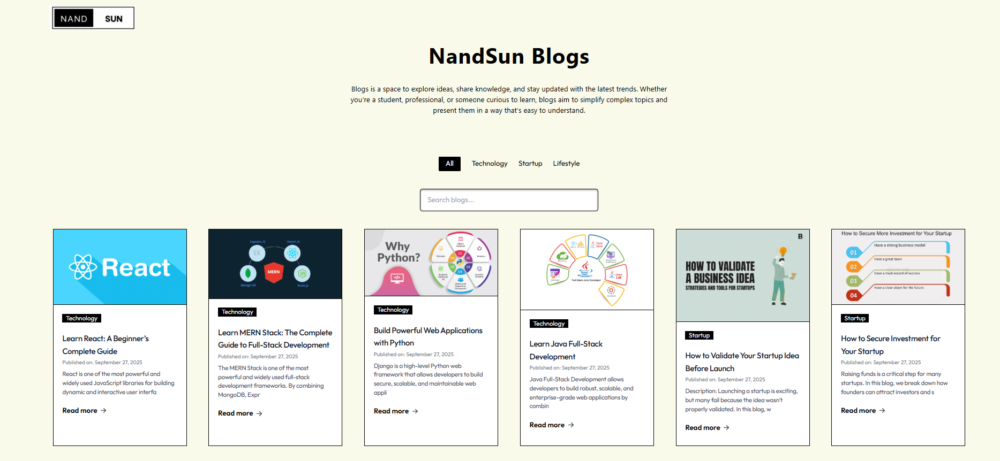

# Blog Website Project

A dynamic blog website with **public pages** and an **admin panel** to manage posts.  
Built with **Next.js**, **React**, **Tailwind CSS**, and **MongoDB Atlas**, with **React Toastify** for notifications.

---

## Features

- **Public Blog Pages**
  - View all blog posts.
  - Access individual blog posts via dynamic routes:
    - `/blogs/[id]` → Dynamic page based on blog ID.
    - `/blogs/[slug]` → Optional dynamic page using a URL-friendly slug for SEO.

- **Admin Area**
  - Add, edit, and delete blog posts.

- **API Routes**
  - Located under `app/api/` and persist data to MongoDB.
  - Models defined in `lib/models/`.

- **Image Upload**
  - Simple server-side handling; images saved in `public/uploads/`.

- **Styling & Notifications**
  - Tailwind CSS for styling.
  - React Toastify for success/error notifications.

- **Database**
  - MongoDB Atlas (cloud-hosted).
  - Models: `BlogModel` and `EmailModel`.

- **API Endpoints**
  - Support `GET`, `POST`, and `DELETE` operations.

---

## Prerequisites

- [Node.js](https://nodejs.org/) v18 or higher
- `npm` 
- [Git](https://git-scm.com/) (optional)
- [MongoDB Compass](https://www.mongodb.com/products/compass) (optional)

---

## Project Setup & Running Locally

1. **Open Project**
   - Unzip the folder and open it in VS Code.

2. **Install Dependencies**
   ```bash
   npm install
## MongoDB Atlas Setup

1. **Register at MongoDB Atlas**  
   - Use your **Google account** to sign up.

2. **Choose the Following Options**  
   - **Primary Goal:** Learn MongoDB  
   - **Experience Level:** New to MongoDB development  
   - **Programming Language:** JavaScript/Node.js  
   - **Data Types & Architecture:** Not sure  

3. **Create a Free Cluster**  
   - Choose **Google Cloud** as the provider.  
   - Name your cluster and click **Create Deployment**.

4. **Create Database User**  
   - Set a **username** and **password** for the database.

5. **Connect to Cluster**  
   - Click **Connect → Connect with MongoDB Compass** (or copy the connection string).  
   - Create a .env.local file and Replace the connection string  with your credentials.
   ex:[MONGODB_URI=mongodb+srv://<username>:<password>@cluster0.kq4wfly.mongodb.net/blog-app?retryWrites=true&w=majority]

6. **Allow Access from Anywhere**  
   - Go to **Network Access → Add IP Address → 0.0.0.0/0**.(delete old ip address)

---

## Open the Project in Your Browser

- **Home / Blog List:** [http://localhost:3000](http://localhost:3000)  
- **Admin Page:** [http://localhost:3000/admin](http://localhost:3000/admin)  

---

## Dependencies

### Main Dependencies
- `next` — 14.0.4  
- `react` — ^18  
- `react-dom` — ^18  
- `axios` — ^1.6.5  
- `mongoose` — ^8.1.0  
- `react-toastify` — ^10.0.3  

### Dev Dependencies
- `tailwindcss` — ^3.3.0  
- `autoprefixer`  
- `postcss`  
- `eslint`  
- `eslint-config-next`  

---

## Environment Variables

- File: .env.local
- Paste your **MongoDB Atlas connection URL** here.

---

## Project Structure

/app
  /api
    /blog/route.js         #Blog GET/POST/DELETE endpoints
    /email/route.js        # Email subscription endpoints
  /admin                  # Admin pages & components
  /blogs/[id]/page.jsx    # Dynamic page by blog ID
  /blogs/[slug]/page.jsx  # Optional dynamic page using slug for SEO
  page.js                 # Home page / Blog list

/Components
  BlogList.jsx
  BlogItem.jsx
  AdminForm.jsx

/lib
  /config/db.js
  /models/BlogModel.js
  /models/EmailModel.js

/public
  /uploads                # Uploaded images (development)

/package.json
/tailwind.config.js
/.env.local


###
for api and database connection i have not used gpt and other tools i have used AI for to create well structured Readme.md file

link of ai  : [https://chatgpt.com/share/68d937fc-4204-800b-a0fe-e3eac43e2e2d];


# Before deployement in vercel the output was in below picture 



# after deployement in vercel the output was 

link : [https://blog-assignment-iota.vercel.app/]